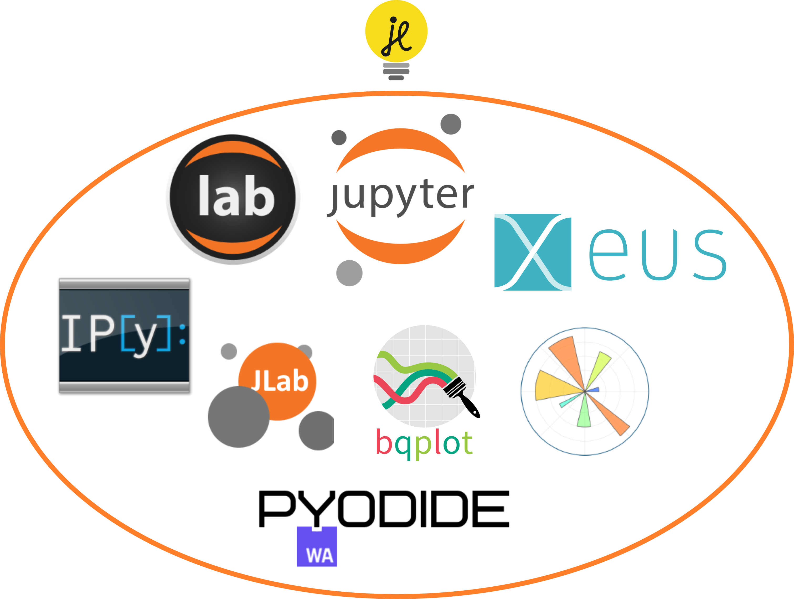

# The Jupyter Ecosystem

## Offsite Event - 2023-05-24

---

# About

## Johan Mabille

- Technical Director at QuantStack
- Jupyter Distinguished Contributor
- Co-authored the xeus stack, the debugger in Jupyter
- Leads the development of mamba

## Jérémy Tuloup

- Technical Director at QuantStack
- Jupyter Distinguished Contributor
- Contributes to JupyterLab, Jupyter Notebook, Voilà
- Author of JupyterLite

---

# History

---

# October 2001

- IPython 0.0.1: 1 file, 110 lines of code (excluding comments)
- IPython 0.1 (November): 3k lines of code

TODO: screenshot IPython

---

# December 2011

- First release of IPython notebook
- IPython 0.12: 46k Python, 3k Javascript

TODO: screenshot notebook

---

# October 2020

- IPython 7.12: 34k Python
- Notebook 6.1: 13k Python, 16k Javascript
- JupyterHub 1.2: 16k Python
- JupyterLab 3.0: 100k Typescript
- 282 repos across 9 GitHub organizations

---

# Governance

---

# 2014: creation of Project Jupyter

- BDFL + steering council model
- Steering council composed of most active members
- Limitations:
    - people not active anymore still in the council
    - the council can not grow undefinitely

---

# 2020: JDC elections

- Jupyter Distinguished Contributors elections
- rewards people active in the community for 2 consecutive years
- cohort of 10 JDC per year

---

# 2022: new governance model

- Executive council: responsible for all dimensions of the project (legal, financial, community, operations, ...)
- Software Steering Council: software-related decisions across Project Jupyter, coordination across subprojects
- Software Subprojects: governance and software decisions of subparts of Project Jupyter (Kernels, Server, JupyterLab, ...)
- Each software subproject nominates a single representative to the SSC

---

# Architecture and Protocol

---

# The Jupyter Kernel Protocol

- Documentation at https://jupyter-client.readthedocs.io/en/stable/messaging.html
- Agnostic to the language
- `jupyter_client` is the reference implementation in Python
- `xeus` is the reference implementation in C++
- Implementations rely on ZeroMQ

---

# The Jupyter kernel protocol

Clients and kernels communicate (over the network) through 5 channels:

- Shell: code execution, code completion
- Control: stop and restart, kernel info, debugging
- stdin: input request
- IOPub: broadcast channel to publish results and kernel state
- Heartbeat: to check the kernel is still alive

ZeroMQ provides the low-level transport layer over which the messages are sent.

---

---

---

---

# Jupyter Server

- Backend to Jupyter Web applications (not the consoles):
    - core services
    - APIs
    - REST endpoints
- Client of kernels
- Responsible for launching and keeping kernels alive
- Use the same protocol for Web apps and kernels

---

# Servers

- Jupyter Server: historical, mono user, based on tornado
- Jupyverse: alternative implementation based on FastAPI
- JupyterHub: multi-user server using Jupyter Server

---

# Kernels

- ipykernel, reference implementation of python kernel
- kernel wrapper approach (kernels based on ipykernel)
- standalone kernels (IJulia, IRKernel)
- xeus-based kernels (xeus-cling, xeus-python, xeus-lua, etc...)

---

---

# Jupyter Widgets

- ipywidgets / xwidgets: basic interactive widgets (sliders, buttons, checkboxes...)
- ipyleaflet / xleaflet: interactive maps based on leaflet
- bqplot / xplot: plotting libraries implementing the grammar of graphics
- many others ....

---

---

# Debugger

---

# Debugger Protocol

- New debug\_request / debug\_reply sent over the control channel
- Content follows the specification of the DAP by Microsoft: https://microsoft.github.io/debug-adapter-protocol/
- Additional messages:
    - dumpCell: maps a temporary file to a cell
    - debugInfo: retrieves debugger state after refresh + dumpCell file computation info
    - inspectVariables: gets defined variables values
    - richInspectVariables: same as previous with rich rendering

---

---

---

---

---

# Using the debugger frontend

---

---

---

---

# VS Code Notebooks vs JupyterLab

---

# VS Code

- Support for Jupyter Widgets (core and custom widgets)
- Integrate with the VS Code debugger (but uses the Jupyter debugger underneath)
- Integrate with GitHub Copilot
- Slightly more complicated to use?

---

# JupyterLab

- Official Jupyter frontend
- Run in the browser by default
- Jupyter AI: ChatGPT-like features coming to JupyterLab: `pip install jupyter-ai`

---

# JupyterLite :bulb:

- WebAssembly powered Jupyter running in the browser
- Stands on the shoulder of giants:
  - Xeus kernels running in the browser
  - JupyterLab and Jupyter Notebook
  - Voici to turn notebooks into static web applications
  - Support for Jupyter Widgets and visualization libraries
- No real `jupyter-server`, `jupyter-client`, `nbconvert`

---

---

---

# JupyterLite

- Used on many websites: [numpy.org](https://numpy.org), [sympy.org](https://sympy.org), [Try Jupyter](https://try.jupyter.org), ...
- Works as a PWA (Progressive Web App) on mobile devices:

---

# JupyterLab 4

---

# New Features

- Performance improvements (Codemirror 6, virtual rendering)
- Real-Time Collaboration improvements (install with `pip install jupyter-collaboration`)
- Improved search
- Table of Contents
- PyPI Extension Manager
- Linked kernels enhancements
- Support for notifications
- JupyterLab Desktop

---

# Notifications

<video controls src="./img/02-notifications.mov"></video>

---

# Search

<video controls src="./img/03-search.mov" ></video>

---

# Cell Toolbar

<video controls src="./img/04-celltoolbar.mov" ></video>

---

# Table of Contents

<video controls src="./img/06-toc.mov" ></video>

---

# Linked Kernel Enhancements

<video controls src="./img/07-linkedkernels.mov" ></video>

---

# Settings Editor

<video controls src="./img/08-settings.mov" ></video>

---

# Performance Enhancmenents

<video controls src="./img/10-performance.mp4" ></video>

---

# Extension Manager

---

# Collaborative Editing

<video controls src="./img/11-RTC.mp4" ></video>

---

# Collaborative Editing for developers

<video controls src="./img/12-jcad-rtc.mp4" ></video>

---

# New extension points

- Notifications
- Custom settings editor
- Metadata editor
- Text editor (CodeMirror 6)
- New completer
- New table of contents
- New search in documents

---

# Jupyter Notebook 7

---

# A new version for Jupyter Notebook

- Notebook 7 includes many new features
- Keeps the same UX and document-centric look and feel
- Uses the same Notebook Format and Jupyter Protocol
- Is compatible with the JupyterLab extension ecosystem

---

---

# Roadmap

- JupyterLab 4 is released :tada:
- Notebook 7 final will soon be released
- JupyterLite 0.2 based on JupyterLab 4 and Notebook 7
- ...

---

# Thanks!

Thanks to Martha Cryan, Afshin T. Darian and Frederic Collonval for their slides on JupyterLab 4.
